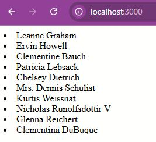

## Repository purpose
This repository supports a [post in my medium blog](https://medium.com/@joncolque/clean-architecture-concepts-in-react-a-guide-to-refactoring-a-common-fetch-to-a-clean-fetch-20187c760da0), demonstrating clean architecture principles applied in React.

### Installation
```bash
npm install
npm run dev
```

### Screenshot of the main screen
